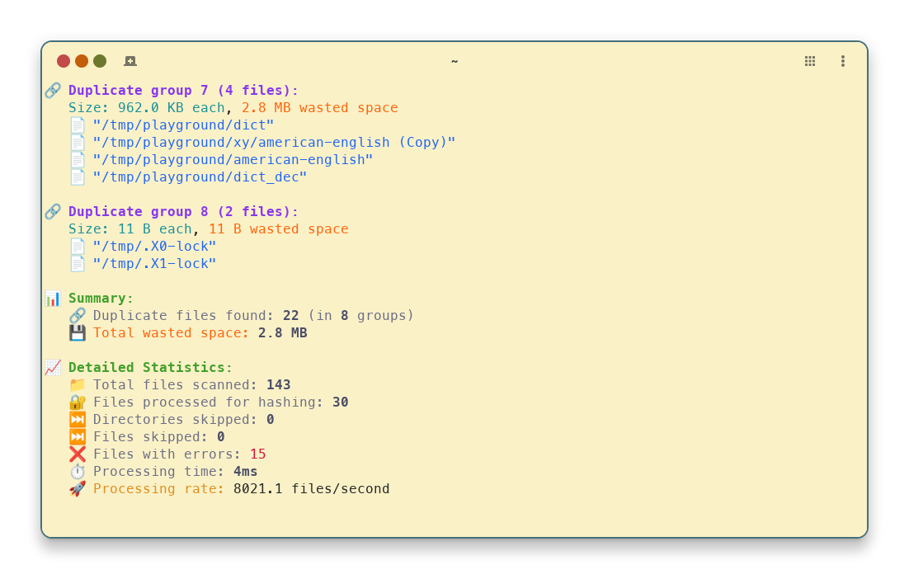

<p align="center">
  
</p>

<!-- <h1 align="center">🧿 doppel</h1> -->
<p align="center"><em>Your filesystem has doppelgängers. Let’s hunt.</em></p>

<p align="center">
  <a href="https://golang.org"></a>
  
  
  
  
  
</p>

---

**doppel** is a blazing-fast, concurrent CLI tool written in Go for scanning directories
and finding duplicate files, aka _doppelgängers_! 🕵️‍♂️🗂️

Save disk space and keep your filesystem clean by quickly identifying and managing duplicate files.
Doppel is designed for speed, flexibility, and reliability.

---

## 📋 Table of Contents

<!-- TOC -->
* [📋 Table of Contents](#📋-table-of-contents)
* [⚡️ Quick Start](#⚡️-quick-start)
* [🔮 Terminal Preview](#🔮-terminal-preview)
* [✨ Features](#✨-features)
* [📦 Installation](#📦-installation)
* [🚀 Usage](#🚀-usage)
  * [🛠️ Command-Line Interface](#🛠️-command-line-interface)
  * [⚙️ Configuration Files](#⚙️-configuration-files)
  * [Environment Variables](#environment-variables)
    * [Automatic Completion](#automatic-completion)
  * [🔎 Find Command](#🔎-find-command)
    * [⚙️ Find Command Options](#⚙️-find-command-options)
  * [🎛️ Preset Command](#🎛️-preset-command)
* [🧬 How It Works](#🧬-how-it-works)
* [🏗️ Development](#🏗️-development)
* [📜 License](#📜-license)
* [🤝 Contributing](#🤝-contributing)
<!-- TOC -->

## ⚡️ Quick Start

Install (requires Go 1.25+):

```sh
go install github.com/dr8co/doppel@latest
```

Scan your home directory for duplicates:

```sh
doppel find ~
```

Or use a preset for common scenarios:

```sh
doppel preset media ~/Pictures
```

## 🔮 Terminal Preview



## ✨ Features

* ⚡️ **Fast scanning** with parallel hashing (Blake3, configurable workers)
* 🔍 **Flexible filtering** by file size, glob patterns, and regular expressions
* 🔇 **Noise reduction** with path and file exclusions
* 📊 **Detailed statistics** and verbose output
* 🛠️ **Dry-run mode** to preview filters
* 📄 **Structured output** for easy integration with other tools. Supported formats:
  * JSON
  * YAML
  * Text (default)
* 🧩 **Extensible presets** for common use cases (media, dev, docs, clean)
* 🧪 **Tested** with unit tests and integration tests
* 💻 **Cross-platform**: Works on Linux, macOS, and Windows
* 🛠️ **Automatic completion** for bash, zsh, fish, and PowerShell
* 📜 **Structured logging** for better automation, debugging, and monitoring. Formats:
  * JSON
  * Text
  * Pretty (default)

## 📦 Installation

**With Go:**

```sh
go install github.com/dr8co/doppel@latest
```

**From source:**

```sh
git clone https://github.com/dr8co/doppel.git
cd doppel
go build -o doppel main.go
```

**Pre-built binaries:**

See the [🚀 releases page](https://github.com/dr8co/doppel/releases).

## 🚀 Usage

### 🛠️ Command-Line Interface

Doppel provides a simple CLI interface. The main command is `doppel`,
with subcommands for different operations.

```sh
doppel [global options] [command [command options]]
```

Run `doppel --help` to see global options and available commands.

> [!NOTE]
> Running `doppel` with no command defaults to `find`.

### ⚙️ Configuration Files

Doppel supports configuration through TOML (recommended), YAML, or JSON files.
Configuration files are automatically loaded from:

* `$CONFIG_DIR/doppel/config.toml`
* `$CONFIG_DIR/doppel/config.yaml`
* `$CONFIG_DIR/doppel/config.json`
* `$CONFIG_DIR/doppel/config` (Assume TOML if no extension)

where `$CONFIG_DIR` is your system's user configuration directory:

* Linux: `~/.config`
* macOS: `~/Library/Application Support`
* Windows: `%AppData%`
* Plan 9: `~/lib`
* Other Unix: `~/.config`

The configuration files can be used to set default values for any command-line options.

The key names in the configuration file match the long option names for each command,
with dashes replaced with underscores.
For example, to set the default minimum file size for the `find` command to 1.5MB,
you would add the following to your TOML configuration file:

```toml
[find]
min_size = "1.5MB"
```

For more details on the TOML format,
see the [TOML spec](https://toml.io/en/v1.0.0 "TOML v1.0.0").

> [!NOTE]
> Command-line arguments take precedence over configuration file values.

### Environment Variables

Doppel also supports configuration through environment variables.
Environment variable names are derived from the command and option names,
with the following rules:

* The prefix `DOPPEL_` is added to all environment variable names.
* The command name is added after the prefix (if applicable).
* The option name is added after the command name.
* All names are converted to uppercase.
* Dashes (`-`) in option names are replaced with underscores (`_`).

For example, to set the default minimum file size for the `find` command to 1.5MB,
you would set the following environment variable:

```bash
DOPPEL_FIND_MIN_SIZE=1.5MB
```

> [!NOTE]
> Environment variables take precedence over configuration file values,
> but are overridden by command-line arguments.

#### Automatic Completion

Doppel supports automatic completion for various shells. To generate completion scripts, run:

```sh
doppel completion <shell>
```

Where `<shell>` is one of: `bash`, `zsh`, `fish`, or `pwsh`.

This will print the completion script to stdout.
You can redirect it to a file or source it directly in your shell.

### 🔎 Find Command

Scan for duplicate files in the current directory:

```sh
doppel find
# or simply
doppel
```

Scan specific directories:

```sh
doppel find /path/to/dir1 /path/to/dir2
```

#### ⚙️ Find Command Options

* `-w, --workers <n>`: Number of parallel hashing workers (default: number of CPUs)
* `-v, --verbose`: Enable verbose output
* `--min-size <size>`: Minimum file size to consider (default: 0 = no limit)
* `--max-size <size>`: Maximum file size to consider (default: 0 = no limit)
* `--exclude-dirs <patterns>`: Comma-separated glob patterns for directories to exclude
* `--exclude-files <patterns>`: Comma-separated glob patterns for files to exclude
* `--exclude-dirs-regex <regexes>`: Comma-separated regex patterns for directories to exclude
* `--exclude-files-regex <regexes>`: Comma-separated regex patterns for files to exclude
* `--show-filters`: Show active filters and exit
* `--output-format <format>`: Output format for duplicate groups (default: pretty, options: `pretty`, `json`, `yaml`)
* `--output-file <file>`: Write output to a file instead of stdout

For more details, run:

```sh
doppel find --help
# or
doppel find help
```

**Examples:**

Find duplicates in `~/Downloads` and `~/Documents`, excluding `.git` directories and files smaller than 1MB:

```sh
doppel find ~/Downloads ~/Documents --exclude-dirs=.git --min-size=1000000 --verbose
# or
doppel find ~/Downloads ~/Documents --exclude-dirs=.git --min-size=1MB --verbose
```

`--min-size` and `--max-size` support the following formats:

* Bytes: `100`, `100B`, `100b` are all equivalent
* Kilobytes: `10KB`, `10kB`, `10Kb`, `10kb`, `10000` are all equivalent
* Kibibytes: `10KiB`, `10kiB`, `10KIB`, `10240` are all equivalent
* Megabytes: `1MB`, `1mB`, `1Mb`, `1mb`, `1000000` are all equivalent
* Mebibytes: `1MiB`, `1miB`, `1MIB`. (same as `1048576`)
* Gigabytes: `1GB`, `1gB`, `1Gb`, `1gb`. (`1000000000`)
* Gibibytes: `1GiB`, `1giB`, `1gIB`. (`1073741824`)
* Terabytes: `1TB`, `1tB`, `1Tb`, `1tb`. (`1000000000000`)
* Tebibytes: `1TiB`, `1tiB`, `1TIb`. (`1099511627776`)
* Petabytes: `1PB`, `1pB`, `1Pb`, `1pb`. (`1000000000000000`)
* Pebibytes: `1PiB`, `1piB`, `1PIB`. (`1125899906842624`)
* Exabytes: `1EB`, `1eB`, `1Eb`, `1eb`. (`1000000000000000000`)
* Exbibytes: `1EiB`, `1eiB`, `1EIB`. (`1152921504606846976`)

Find duplicates in `/var/logs`, excluding all `.log` files and directories starting with `temp`,
and ignoring empty files:

```sh
doppel find /var/logs --min-size=1 --exclude-files="*.log" --exclude-dirs="temp*" # Be sure to quote patterns!
```

> [!NOTE]
> When using glob patterns and regexes, be sure to quote (and escape, if necessary) them to prevent shell expansion.

### 🎛️ Preset Command

Use presets for common duplicate-hunting scenarios:

* `dev`: Skip development directories and files (e.g., build, temp, version control)
* `media`: Focus on media files (images/videos), skip small files
* `docs`: Focus on document files
* `clean`: Skip temporary and cache files

**Usage:**

```sh
doppel preset <preset> [options]
```

Where `<preset>` is one of: `dev`, `media`, `docs`, or `clean`.

Preset options are the same as for `find`.

**Example:**

Find duplicate media files in your `~/Pictures` folder:

```sh
doppel preset media ~/Pictures
```

## 🧬 How It Works

1. **File Discovery**: Recursively scans specified directories (and their subdirectories), applying filters.
2. **Grouping**: Groups files by size to quickly eliminate non-duplicates.
3. **Hashing**: Computes Blake3 hashes for files with matching sizes.
4. **Reporting**: Displays groups of duplicate files and optional statistics.

## 🏗️ Development

* 📁 Code is organized in `cmd/`, `internal/`, and `assets/` directories.
* 🧩 Uses [urfave/cli/v3](https://github.com/urfave/cli) for CLI parsing.
* 🔑 Uses [blake3](https://github.com/lukechampine/blake3) for fast hashing.
* 🧪 Run tests with:

  ```sh
  go test -race -v ./...
  ```

## 📜 License

This project is licensed under the MIT License. See [LICENSE](LICENSE) for details.

## 🤝 Contributing

Contributions, issues, and feature requests are welcome!
Please open an issue or pull request on [GitHub](https://github.com/dr8co/doppel).

---

**doppel** — Find your duplicate files, fast and reliably. ✨
