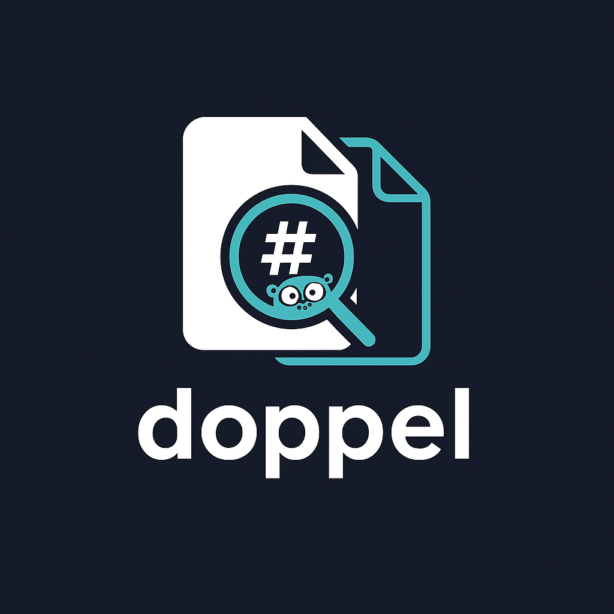

<p align="center">
  
</p>

<!-- <h1 align="center">🧿 doppel</h1> -->
<p align="center"><em>Your filesystem has doppelgängers. Let’s hunt.</em></p>

<p align="center">
  <a href="https://golang.org"></a>
  
  
  
  
  
</p>

---

**doppel** is a fast, concurrent CLI tool written in Go that scans directories for duplicate files —
or as we like to call them, _doppelgängers_! 🕵️‍♂️🗂️

Instead of wasting storage on redundant data, `doppel` helps you:

- ⚡️ Hash files quickly using Blake3
- 🚫 Filter out noise with path exclusions
- 🏃‍♂️ Hunt duplicates with a concurrency-driven engine
- 📋 Get readable summaries of all matching files

## 🔮 Terminal Preview

## ✨ Features

- ⚡️ **Fast scanning** using parallel hashing (configurable workers)
- 🔍 **Flexible filtering** by file size, glob patterns, and regular expressions
- 📊 **Detailed statistics** and verbose output options
- 🛠️ **Dry-run mode** to show active filters without scanning
- 📄 **Clear, readable output** for duplicate groups

## 📦 Installation

Please ensure you have Go 1.24+ installed.

Install directly:

```sh
go install github.com/dr8co/doppel@latest
```

Or clone and build manually:

```sh
git clone https://github.com/dr8co/doppel.git
cd doppel
go build -o doppel main.go
```

Alternatively, pre-built binaries are available for download on the
[🚀 releases page](https://github.com/dr8co/doppel/releases).

## 🚀 Usage

> **ℹ️ Note:** If you run `doppel` without specifying a command, it defaults to the `find` command.

### 🔎 Find Command

Run `doppel find` (or simply `doppel`) to scan for duplicate files in the current directory:

```sh
./doppel find
# or simply
./doppel
```

Or specify one or more directories:

```sh
./doppel find /path/to/dir1 /path/to/dir2
```

#### ⚙️ Find Command Options

- `-w, --workers <n>`: Number of parallel hashing workers (default: number of CPUs)
- `-v, --verbose`: Enable verbose output
- `--min-size <bytes>`: Minimum file size to consider (default: 0)
- `--max-size <bytes>`: Maximum file size to consider (default: 0 = no limit)
- `--exclude-dirs <patterns>`: Comma-separated glob patterns for directories to exclude
- `--exclude-files <patterns>`: Comma-separated glob patterns for files to exclude
- `--exclude-dir-regex <regexes>`: Comma-separated regex patterns for directories to exclude
- `--exclude-file-regex <regexes>`: Comma-separated regex patterns for files to exclude
- `--show-filters`: Show active filters and exit
- `--stats`: Show detailed statistics at the end

##### 🧪 `find` Example

Find duplicates in `~/Downloads` and `~/Documents`, excluding `.git` directories and files smaller than 1MB:

```sh
./doppel find ~/Downloads ~/Documents --exclude-dirs=.git --min-size=1048576 --stats
```

### 🎛️ Preset Command

The `preset` command quickly searches for duplicate files using predefined filter settings for common scenarios.
Each preset applies a set of filters tailored for a specific use case:

- `dev`: Skip development directories and files (e.g., build, temp, version control)
- `media`: Focus on media files (images/videos), skip small files
- `docs`: Focus on document files
- `clean`: Skip temporary and cache files

#### 🔧 Preset Command Usage

```sh
./doppel preset <preset> [options]
```

Where `<preset>` is one of: `dev`, `media`, `docs`, or `clean`.

#### ⚙️ Preset Command Options

Same as `find` command options.

##### 🧪 `preset` Example

Find duplicate media files in your `~/Pictures` folder:

```sh
./doppel preset media ~/Pictures --stats
```

## 🧬 How It Works

1. **File Discovery**: Recursively scans specified directories, applying filters.
2. **Grouping**: Groups files by size to quickly eliminate non-duplicates.
3. **Hashing**: Computes Blake3 hashes for files with matching sizes.
4. **Reporting**: Displays groups of duplicate files and optional statistics.

## 🏗️ Development

- 📁 Code is organized in `cmd/`, `internal/`, and `pkg/` directories.
- 🧩 Uses [urfave/cli/v3](https://github.com/urfave/cli) for CLI parsing.
- 🔑 Uses [blake3](https://github.com/lukechampine/blake3) for fast hashing.
- 🧪 Run tests with:

  ```sh
  go test ./...
  ```

## 📜 License

This project is licensed under the MIT License. See [LICENSE](LICENSE) for details.

## 🤝 Contributing

Contributions, issues, and feature requests are welcome! Please open an issue or pull request on GitHub.

---

**doppel** — Find your duplicate files, fast and reliably. 🧿✨
